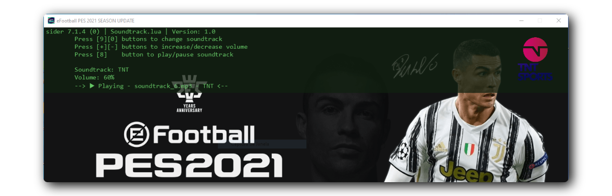

<h1 align="center">PES 2021 Scripts</h1>

<div align="center">
    
    
    
    
</div>

<p align="center"></p>

## :page_with_curl: Description
This repository is designed to develop my own additional scripts for [Sider](https://mapote.com/doc/sider/sider7/readme.html) (complementary program for PES 2021 and PES 2021 Lite)

## :game_die: Features
- [x] PlayerName
- [x] Goal Soundtrack
- [x] Ringtone

## :gear: How to install
1 - Add the .lua file to the your "eFootball PES 2021\modules" folder. 
There are currently only 3 available:
- Soundtrack.lua
- Ringtone.lua
- Playname.lua

2 - Open the sider.ini file and add 
```
// ...
; Lua settings
lua.enabled = 1
luajit.ext.enabled = 1

lua.module = "Soundtrack.lua"
lua.module = "PlayerName.lua"
lua.module = "Ringtone.lua"

// ...
```

## :hammer_and_wrench: Tools
<p>

</p>

## :adult: Contribuidores

<!-- ALL-CONTRIBUTORS-LIST:START - Do not remove or modify this section -->
<!-- prettier-ignore-start -->
<!-- markdownlint-disable -->
<table>
  <tbody>
    <tr>
      <td align="center" valign="top" width="14.28%"><a href="https://gustavohenrique.vercel.app/"><br /><sub><b>Gustavo Henrique</b></sub></a><br /><a href="#code-Gustavohps10" title="Code">💻</a></td>
    </tr>
  </tbody>
</table>

<!-- markdownlint-restore -->
<!-- prettier-ignore-end -->

<!-- ALL-CONTRIBUTORS-LIST:END -->
